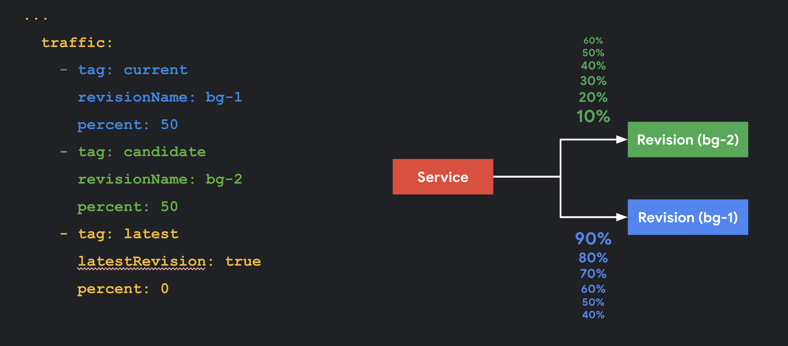
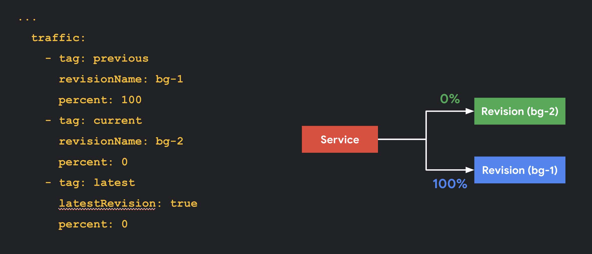

# Demo: Traffic Splitting (aka blue/green deployment)

This demo shows how to update an application to a new version using a blue/green
traffic routing pattern. With Knative, you can safely reroute traffic from a live version
of an application to a new version by changing the routing configuration. And, if necessary, Knative also supports rolling back to a know version of the application when necessary.

> Using custom domain with wildcard SSL cert configured for `demo.knative.tech`.

## Deploying Initial Version (Blue)


Deploy regular Knative service using `Configuration` and `Route`:

`kubectl apply -f stage1.yaml`

Deploying Knative Service creates the following child resources:

* Knative Route
* Knative Configuration
* Knative Revision
* Kubernetes Deployment
* Kuberentes Service

When the service is created, you can navigate to https://bg.demo.knative.tech to view the deployed app.

You can inspect the created resources with the following `kubectl` commands:

```shell
kubectl get ksvc bg -n demo
kubectl get route -l "serving.knative.dev/service=bg" -n demo
kubectl get service -l "serving.knative.dev/service=bg" -n demo
kubectl get configuration -l "serving.knative.dev/service=bg" -n demo
kubectl get revision -l "serving.knative.dev/service=bg" -n demo
kubectl get deployment -l "serving.knative.dev/service=bg" -n demo
```

## Deploying Version 2 (Green)


Version 2 of the sample application displays the text "App v2" on a green background:

`kubectl apply -f stage2.yaml`

Version 2 of the app is staged at this point. That means:

* No traffic is routed to Version 2 at the main URL
* Knative creates a named v2 route for testing the newly deployed version


You can refresh the app URL (https://bg.demo.knative.tech) to see that the `v2` app takes no traffic, but you can navigate there directly https://bg-candidate.demo.knative.tech

## Migrating traffic to the new version



Deploy the updated routing configuration to your cluster:

`kubectl apply -f stage3.yaml`

Now, refresh the original route https://bg.demo.knative.tech a few times to see
that some traffic now goes to version 2 of the app.

> This sample shows a 50/50 split to assure that you don't have to refresh too much, but it's recommended to start with 1-2% of traffic in a production environment while you monitoring metrics for the desired effect.

## Re-routing all traffic to the new version

Deploy the updated routing configuration to your cluster:

`kubectl apply -f stage4.yaml`

This will complete the deployment by sending all traffic to the new (green) version.

Refresh original route https://bg.demo.knative.tech a few times to verify that
no traffic is being routed to `v1` of the app.

Note that:

* We kept the `v1` (blue) entry with 0% traffic for the sake of speedy reverting, if that is ever necessary.
* We added the named route `v1` to the old (blue) version of the app to allow access for comparison reasons.

Now you can navigate to https://bg-previous.demo.knative.tech to show that the old version
is accessible via the `v1` named route.

## Rall-back to initial release



If needed, you can rall back to the last know to be good revision

`kubectl apply -f stage5.yaml`

This will complete reroute all traffic to the initial revision. Refresh https://bg.demo.knative.tech to see all traffic being sent to the original revision.


## Cleanup

To delete the demo app, enter the following command:

```
kubectl delete -f stage1.yaml
```
