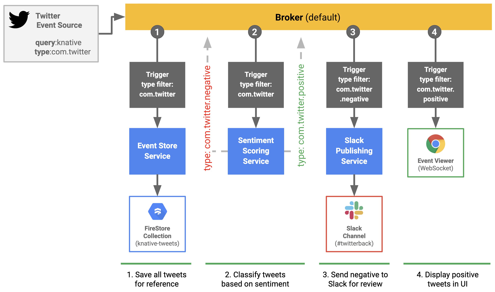

# Twitter, Knative Service, Cloud Firestore

Simple pipeline of Twitter search event source using cluster local Knative service to persisting tweets to Cloud Firestore collection.



### Cloud Firestore

To enable Firestore in your GCP project, [create Cloud Firestore project](https://console.cloud.google.com/projectselector/apis/api/firestore.googleapis.com/overview), which will also enables your API in the Cloud API Manager.

### Twitter API/Secrets

To configure this event source you will need Twitter API access keys. [Good instructions on how to get them](https://iag.me/socialmedia/how-to-create-a-twitter-app-in-8-easy-steps/)

Once you have the Twitter API keys configured, create a Knative secret:

```shell
kubectl create secret generic ktweet-secrets -n demo \
    --from-literal=T_CONSUMER_KEY=${T_CONSUMER_KEY} \
    --from-literal=T_CONSUMER_SECRET=${T_CONSUMER_SECRET} \
    --from-literal=T_ACCESS_TOKEN=${T_ACCESS_TOKEN} \
    --from-literal=T_ACCESS_SECRET=${T_ACCESS_SECRET}
```

### Event Source

The search term used by Twitter Event Source is defined in the `config/twitter-source.yaml` under `--query=YourSearchTermHere`.

Once you are done editing the `config/twitter-source.yaml` that, save it and apply to your Knative cluster:


```shell
kubectl apply -f config/twitter-source.yaml -n demo
```

Should return

```shell
containersource.sources.eventing.knative.dev/twitter-source created
```

Verify that `twitter-source` source was created

```shell
kubectl get sources -n demo
```

Should return

```shell
NAME                                                          AGE
containersource.sources.eventing.knative.dev/twitter-source   1m
```

### Service

The only think in deploying the Knative service which will persist tweets returned by event source is the `GCP_PROJECT_ID` variable in `config/store-service.yaml`. While the use of project ID has generally been deprecated, the Firestore client still requires it to create client.

```yaml
env:
  - name: GCP_PROJECT_ID
    value: "s9-demo"
```

Once you are done editing `config/store-service.yaml` file, you can apply it to your Knative cluster the same way you configured the above event source.


```shell
kubectl apply -f config/store-service.yaml -n demo
```

The response should be

```shell
service.serving.knative.dev/eventstore created
```

To check if the service was deployed successfully you can check the status using `kubectl get pods -n demo` command. The response should look something like this (e.g. Ready `3/3` and Status `Running`).

```shell
NAME                                          READY     STATUS    RESTARTS   AGE
eventstore-0000n-deployment-5645f48b4d-mb24j  3/3       Running   0          10s
```

### Trigger

Now that you have both the event source and service configured you can wire these two with simple trigger. You should not have to edit the `config/store-trigger.yaml` file unless you made some naming changes above.

Two things to point here, were are using `type: com.twitter` filter to send to our `eventstore` service only the events of twitter type. We also define the target service here by defiing its reference in the `subscriber` portion of trigger.

```yaml
apiVersion: eventing.knative.dev/v1alpha1
kind: Trigger
metadata:
  name: twitter-events-trigger
spec:
  filter:
    sourceAndType:
      type: com.twitter
  subscriber:
    ref:
      apiVersion: serving.knative.dev/v1alpha1
      kind: Service
      name: eventstore
```

To create a trigger run:

```shell
kubectl apply -f config/store-trigger.yaml -n demo
```

Should return

```shell
trigger.eventing.knative.dev/twitter-events-trigger created
```

Verity that `twitter-events-trigger` trigger was created

```shell
kubectl get triggers -n demo
```

Should return

```shell
NAME                     READY   REASON    BROKER    SUBSCRIBER_URI                                          AGE
twitter-events-trigger   True              default   http://twitter-events-trigger.demo.svc.cluster.local/   12s
```

## Demo

You should be able to see the Cloud Events being saved in your Firestore console under the `cloudevents` collection.

You can also monitor the logs for both `twitter-source`

```shell
kubectl logs -l eventing.knative.dev/source=twitter-source -n demo -c source
```

and `store-service`

```shell
kubectl logs -l serving.knative.dev/service=eventstore -n demo -c user-container
```

## Issues

### Stalled in-memory channel dispatcher

If your source generates tweets but no events arrive in `eventstore` you may have to bounce the `in-memory-channel-dispatcher-******`. First, list the pods in `knative-eventing` namespace

```shell
# list pods in eventing namespace
kubectl get pods -n knative-eventing
```

That will return something like this

```shell
NAME                                             READY   STATUS    RESTARTS   AGE
eventing-controller-774f79f989-bz4xl             1/1     Running   0          20d
gcp-pubsub-channel-controller-7868cd487c-sk7pd   1/1     Running   0          20d
gcp-pubsub-channel-dispatcher-7756c787dc-4vssf   2/2     Running   2          20d
in-memory-channel-controller-5c686c86c7-dpf2g    1/1     Running   0          20d
in-memory-channel-dispatcher-7bcd7f556-v7xx7     2/2     Running   2          13m
webhook-5b689bfcc4-52tlz                         1/1     Running   0          4d20h
```

Find the name of your `in-memory-channel-dispatcher-******` on your cluster and delete it

```shell
kubectl delete pod in-memory-channel-dispatcher-****** -n knative-eventing
```

## Reset

Run this before each demo to set known state

```shell
kubectl delete -f config/ -n demo --ignore-not-found=true
```